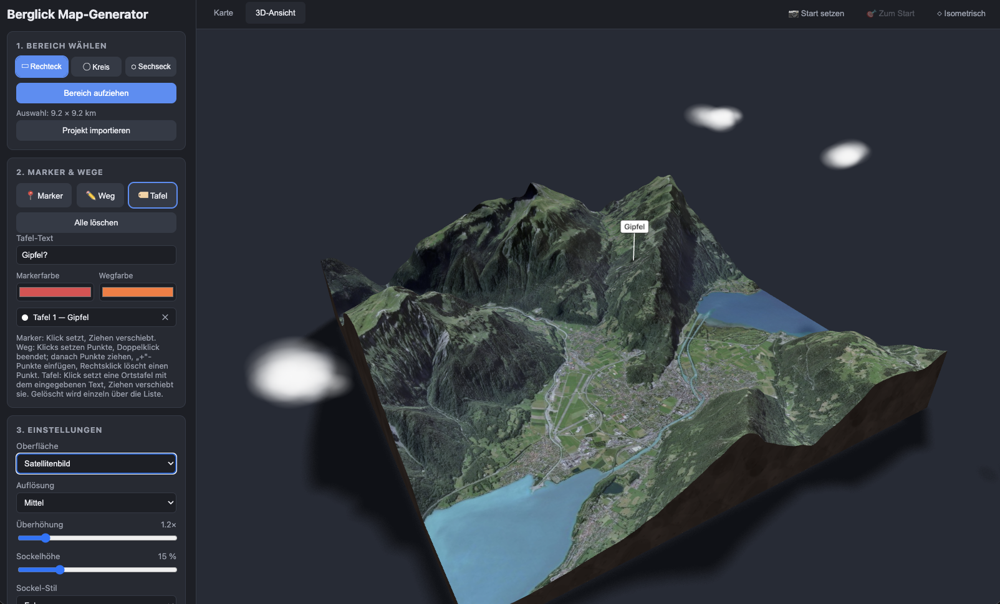
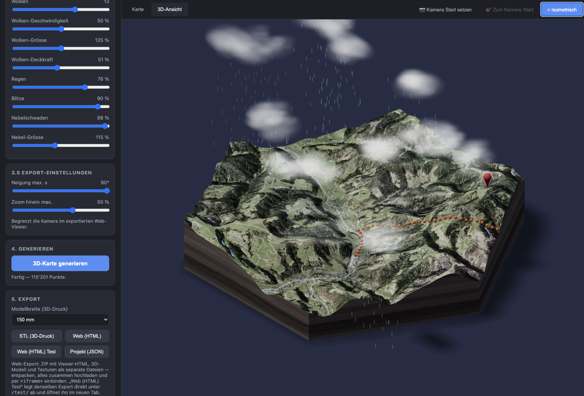

# Berglick Map-Generator

Web-App zum Erzeugen von 3D-Geländemodellen aus einem frei wählbaren Kartenausschnitt.



### Wettersimulation & Atmosphäre



Das 3D-Modell lässt sich mit einer stimmungsvollen Wetter- und Atmosphärensimulation
beleben – von leichter Bewölkung bis zum Gewitter. Alle Effekte werden in Echtzeit
gerendert und bleiben beim Web-Export erhalten:

- **Wolken:** Anzahl, Zuggeschwindigkeit, Grösse und Deckkraft sind frei einstellbar.
  Die Wolken ziehen über das Gelände und werfen wandernde Schatten auf die Oberfläche.
- **Regen:** Unter den Wolken fallen sichtbare Regenschauer; die Regenstärke ist
  stufenlos regelbar.
- **Blitze:** Zufällige Blitzeinschläge lassen die Szene kurz aufleuchten und erzeugen
  eine echte Gewitterstimmung.
- **Nebelschwaden:** Bodennaher Nebel legt sich in Grösse und Dichte einstellbar über
  die Täler und Hänge und bleibt dabei innerhalb der Modellgrenzen.
- **Schneefall:** Innerhalb der Modellgrenzen taumeln Flocken langsam zu Boden; die
  Schneemenge ist stufenlos regelbar (auch unabhängig von Wolken).
- **Licht & Schatten:** Sonnenstand (Rotation und Höhenwinkel), Belichtung sowie Härte
  und Stärke der Schatten sind konfigurierbar – für weiche Morgen- oder harte
  Mittagsstimmungen.

## Starten

Empfohlen per Docker (bringt PHP 8.3 samt `gd` und `curl` mit):

```bash
docker compose up
```

Alternativ direkt mit lokalem PHP:

```bash
php -S localhost:8123 -t public
```

Danach im Browser öffnen: <http://localhost:8123>

### Entwicklung im Container

Das Projekt ist als Bind-Mount eingebunden — Codeänderungen wirken sofort, ohne
Rebuild. Nur nach Änderungen am `Dockerfile` oder an `docker/php.ini` ist ein
`docker compose build` nötig. Der Tile-Cache unter `cache/` liegt weiterhin auf
dem Host und übersteht damit Container-Neustarts.

## Funktionen

- **Kartenausschnitt wählen:** Der gewünschte Bereich wird direkt auf der Karte per Auswahlwerkzeug (Rechteck, Kreis oder Sechseck) festgelegt. Die Auswahl ist auf maximal 15 × 15 km begrenzt.
- **Overlays setzen:** Marker, Wege, Ortstafeln und Highlights lassen sich per Klick auf der Karte platzieren und werden im 3D-Modell auf dem Gelände dargestellt. **Highlights** sind Symbol-Schilder: Aus der Icon-Bibliothek (`public/assets/icons/`) wird ein Icon gewählt, das auf einer farbigen Scheibe über dem Gelände schwebt — Icon und Farbe sind pro Highlight frei einstellbar. Weitere Icons lassen sich ergänzen, indem einfarbige SVGs in den Ordner gelegt und in `public/assets/js/ui/icons.js` unter `HIGHLIGHT_ICONS` eingetragen werden.
- **Export als STL:** Das erzeugte Geländemodell kann STL exportiert werden – direkt geeignet für den 3D-Druck.
- **Export als eigenständiges iframe:** Alternativ lässt sich das Modell als statischer, interaktiver Web-Viewer exportieren, der z. B. per `<iframe>` in eine eigene Website eingebettet werden kann. Das Modell (`terrain.glb`) wird dabei mit `EXT_meshopt_compression` komprimiert (typisch ~85 % kleiner), die Texturen als WebP gespeichert (mit JPG- bzw. PNG-Fallback, falls der Browser kein WebP kodieren kann).

### API des exportierten iframes

Der exportierte Web-Viewer lässt sich von der einbettenden Seite aus per JavaScript steuern. Die Namen der Overlays entsprechen den Nummern aus der App: `marker-<Nr>`, `weg-<Nr>`, `tafel-<Nr>`, `highlight-<Nr>`.

> Dieselbe Beschreibung liegt jedem Web-Export als `ANLEITUNG.md` bei — inklusive aller Wertebereiche und der in `projekt.json` editierbaren Felder.

**Cross-origin per `postMessage`** (funktioniert auch, wenn iframe und Seite auf unterschiedlichen Domains liegen):

```html
<iframe id="karte" src="terrain-3d.html" width="800" height="600" style="border:0"></iframe>

<script>
const karte = document.getElementById('karte');

// Weg 1 ausblenden
karte.contentWindow.postMessage(
  { type: 'overlay-visibility', name: 'weg-1', visible: false },
  '*'
);

// Marker 2 umschalten
karte.contentWindow.postMessage({ type: 'overlay-toggle', name: 'marker-2' }, '*');

// Verfügbare Namen abfragen
window.addEventListener('message', (e) => {
  if (e.data && e.data.type === 'overlay-list') console.log(e.data.names);
});
karte.contentWindow.postMessage({ type: 'overlay-list' }, '*');

// Wolken steuern (alle Felder optional)
karte.contentWindow.postMessage(
  { type: 'clouds', count: 10, speed: 80, size: 150, opacity: 60, color: '#ffffff', rain: 40 },
  '*'
);
karte.contentWindow.postMessage({ type: 'clouds', count: 0 }, '*'); // Wolken aus
karte.contentWindow.postMessage({ type: 'clouds', color: '#cbd5e1' }, '*'); // Wolkenfarbe
karte.contentWindow.postMessage({ type: 'clouds', rain: 0 }, '*');  // Regen aus

// Schneefall (0–100)
karte.contentWindow.postMessage({ type: 'snow', snow: 70 }, '*');

// Klicks auf Overlays empfangen (name ist null, wenn daneben geklickt wurde)
window.addEventListener('message', (e) => {
  if (e.data && e.data.type === 'overlay-click') console.log(e.data.name);
});
</script>
```

**Same-origin direkt über `contentWindow.terrainViewer`** (iframe und Seite auf derselben Domain):

```js
const karte = document.getElementById('karte');
const viewer = karte.contentWindow.terrainViewer;

viewer.setVisible('weg-1', false);
viewer.toggle('marker-2');
viewer.getVisible('weg-1');   // true | false | null
viewer.list();                // alle steuerbaren Namen

viewer.setClouds({ opacity: 50, rain: 40 });
viewer.getClouds();           // { count, speed, size, opacity, rain }

viewer.setSnow(70);           // Schneefall 0–100 (auch { snow: 70 })
viewer.getSnow();             // { snow }

// Klicks auf Marker, Wege, Tafeln und Highlights
const abmelden = viewer.onClick((name) => console.log(name));
abmelden();                   // oder: viewer.offClick(handler)
```

Ausgeblendete Overlays sind nicht anklickbar, und das Drehen der Kamera löst keinen Klick aus.

Weitere Einstellungen (Hintergrundfarbe, Marker-/Wegfarben, Licht, Schatten) lassen sich direkt in der mitexportierten `projekt.json` anpassen, ohne erneut exportieren zu müssen.

## Datenquellen

- **Höhendaten:** [Terrain Tiles](https://registry.opendata.aws/terrain-tiles/)
  (Mapzen/AWS Open Data, Terrarium-Kodierung, frei nutzbar)
- **Karte:** © [OpenStreetMap](https://www.openstreetmap.org/copyright)-Mitwirkende
- **Satellitenbilder:** © Esri World Imagery

Voraussetzungen: PHP ≥ 8.1 mit den Extensions `gd` und `curl`.
